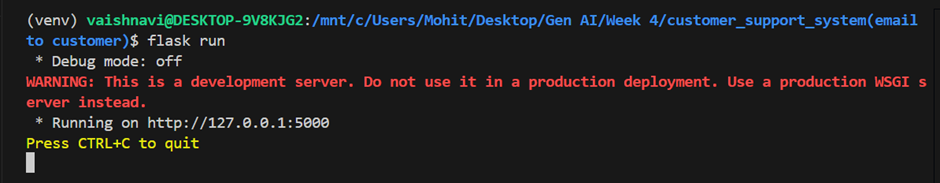
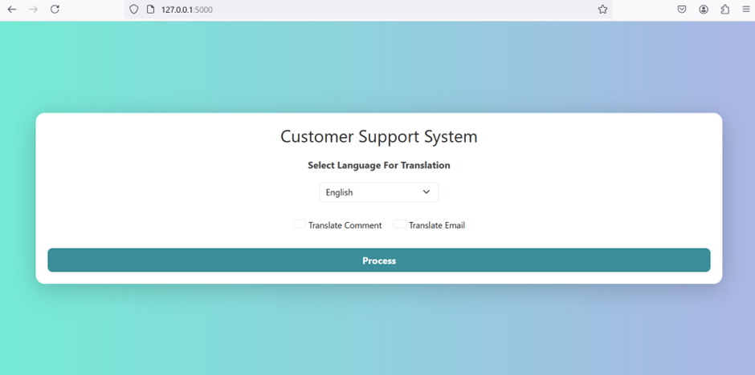
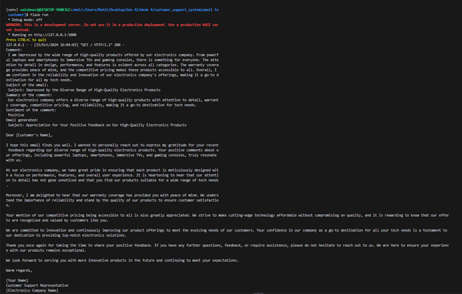
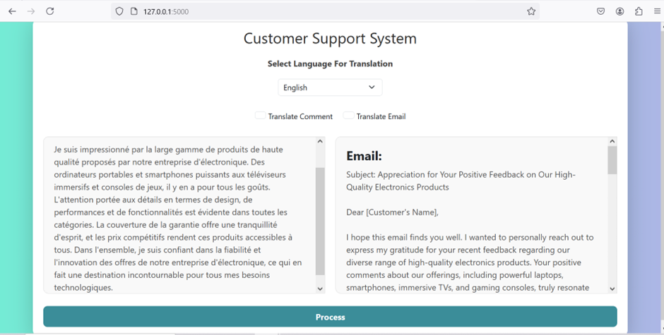
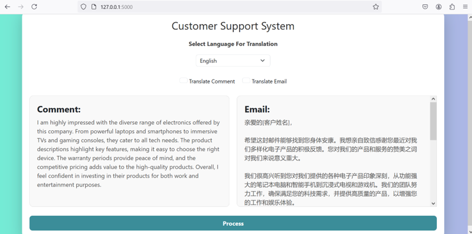

# Customer Support System

## Overview
This project is a customer support system that generates customer comments, email subjects, summaries, and emails based on product input using OpenAI GPT models. It also includes functionality for sentiment analysis and translation of the generated content into different languages.

## Features
- Generate customer comments based on product descriptions
- Generate email subjects from comments
- Summarize customer comments
- Perform sentiment analysis (positive or negative) on comments
- Create a well-structured email based on the comment, subject, and sentiment
- Translate the generated content (comments or emails) into multiple languages
- Web interface built using Flask and Bootstrap for user interaction


## Installation

1. Clone the repository:
   ```bash
   git clone https://github.com/vaishnavi477/Machine-Learning.git
   cd Customer Support System/An Email to Customer/Main Code/
   ```

2. Create and activate a virtual environment:
   ```bash
   python -m venv venv
   source venv/bin/activate  # On Windows: venv\Scripts\activate
   ```

3. Install the required Python packages:
   
   requirements.txt includes
   Flask==2.2.2     # Replace with latest version
   openai==0.27.0
   python-dotenv==0.21.0
   ```bash
   pip install -r requirements.txt
   ```

5. Create a `.env` file in the root directory of the project and add your OpenAI API key:
   ```
   OPENAI_API_KEY=your_openai_api_key # Replace with your api key
   ```

6. Run the `.env` file:
   ```bash
   source /.env
   ```
   
## Usage

1. Run the Flask app:
   ```bash
   flask run
   ```

2. Open your browser and go to the local server link (usually http://127.0.0.1:5000/) to interact with the chatbot.

## Customization

### Modify CSS Styling
To change the page styles, update the CSS in the `<style>` block in index.html:
```index.html
        body {
            background: linear-gradient(to right, #74ebd5, #ACB6E5);
            font-family: 'Segoe UI', Tahoma, Geneva, Verdana, sans-serif;
            margin: 0;
            padding: 0;
            height: 100vh;
            display: flex;
            justify-content: center;
            align-items: center;
        }
        .container {
            width: 90%;
            max-width: 1200px;
            padding: 20px;
            background: white;
            border-radius: 15px;
            box-shadow: 0 8px 40px rgba(0, 0, 0, 0.2);
        }
        h1 {
            color: #2d2d2d;
            margin-bottom: 20px;
            text-align: center;
            font-size: 1.8rem;
        }
        .form-label {
            font-weight: bold;
            color: #444;
        }
        .form-select, .form-check-input {
            font-size: 0.9rem;
            padding: 5px 10px;
            margin-bottom: 10px;
        }
        .form-check-label {
            font-size: 0.9rem;
        }
        .btn-primary {
            background-color: #3b8d99;
            border: none;
            font-weight: bold;
            padding: 8px 12px;
            transition: background-color 0.3s ease;
            border-radius: 8px;
        }
        .btn-primary:hover {
            background-color: #1f5f65;
        }
        .results-container {
            display: flex;
            justify-content: space-between;
            gap: 20px;
            margin-top: 20px;
            height: 300px;
        }
        .result {
            flex: 1;
            padding: 20px;
            border: 1px solid #ddd;
            border-radius: 10px;
            background-color: #f9f9f9;
            overflow: auto;
        }
        h4 {
            margin-bottom: 10px;
            font-weight: bold;
        }
        p {
            margin-bottom: 0;
            color: #555;
            white-space: pre-wrap;
        }
        .d-flex-center {
            display: flex;
            justify-content: center;
            align-items: center;
            flex-direction: column;
        }
        .checkbox-container {
            display: flex;
            justify-content: center;
            gap: 20px;
            margin-top: 10px;
        }
        @media (max-width: 768px) {
            .results-container {
                flex-direction: column;
                width: auto;
                height: auto;
            }
            .container {
                padding: 15px;
            }
            h1 {
                font-size: 1.5rem;
            }
        }
```

## Contact
For any queries, feel free to reach out to the project maintainer at vaishnavigpatil21640@gmail.com.

## Screenshot of execution results





