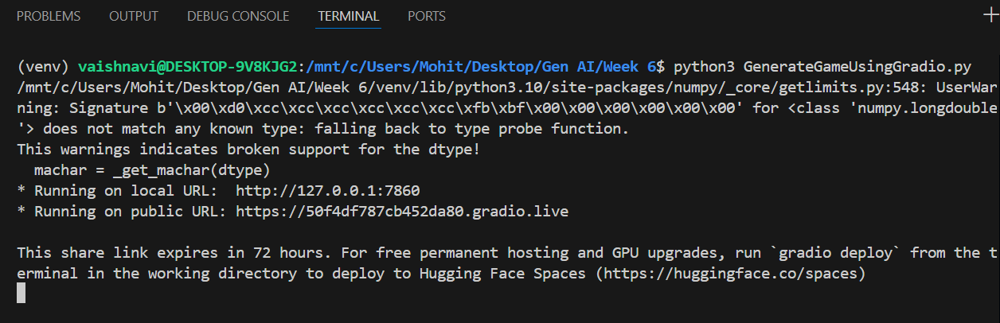
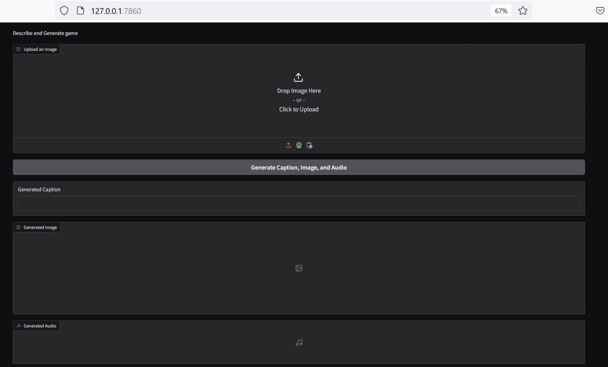
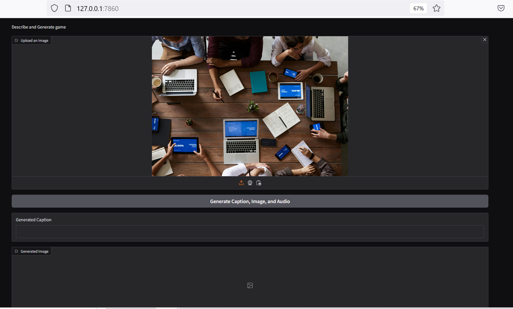
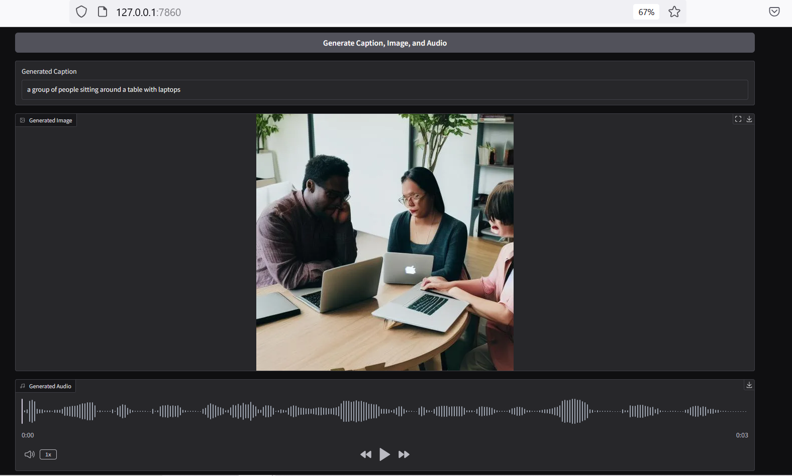

# Describe and Generate Game Using Gradio

# Image to Text, Text to Image and Text to Audio

This project uses Hugging Face APIs to analyze uploaded images, generate a descriptive caption, convert the caption into a related image, and produce audio for the caption. It is built with Python and Gradio for a smooth user interface.

## Features
- Image Captioning: Generates a caption for an uploaded image.
- Image Generation: Creates an image based on the caption.
- Audio Generation: Converts the caption text to audio.
- User-friendly web interface using Gradio.

## Setup

### Requirements
- Python 3.7 or higher
- requests
- Pillow
- python-dotenv
- gradio
- Hugging Face API key with access to:
  - Text-to-Image model (Stable Diffusion v1.5)
  - Image-to-Text model (BLIP)
  - Text-to-Speech model (FastSpeech2)

### 1. Clone the Repository
```bash
git clone https://github.com/vaishnavi477/Machine-Learning.git
cd Describe and Generate Game Using Gradio
```

### 2. Set Up Virtual Environment
Create and activate a virtual environment to manage dependencies.
On macOS and Linux:
```bash
python3 -m venv venv
source venv/bin/activate
```

### 3. Install Dependencies
Once the virtual environment is activated, install the required packages.
```bash
pip install -r requirements.txt
```

### 4. Configure Environment
Create a ".env" file in same folder as python code with your Hugging Face API key and model endpoints:
```
HF_API_KEY=your_hugging_face_api_key
HF_API_TTI_BASE=https://api-inference.huggingface.co/models/runwayml/stable-diffusion-v1-5
HF_API_ITT_BASE=https://api-inference.huggingface.co/models/Salesforce/blip-image-captioning-base
HF_API_TTS_BASE=https://api-inference.huggingface.co/models/facebook/fastspeech2-en-ljspeech
```

### 5. Run the Application
```bash
python3 GenerateGameUsingGradio.py
```

### Usage

1. Upload an image.
2. Click "Generate Caption, Image, and Audio."
3. View the caption, generated image, and listen to the audio.

### License
This `README.md` file now includes the steps for creating and activating a virtual environment before installing dependencies. This will help keep the project dependencies isolated from other Python projects.

## Screenshots of execution




