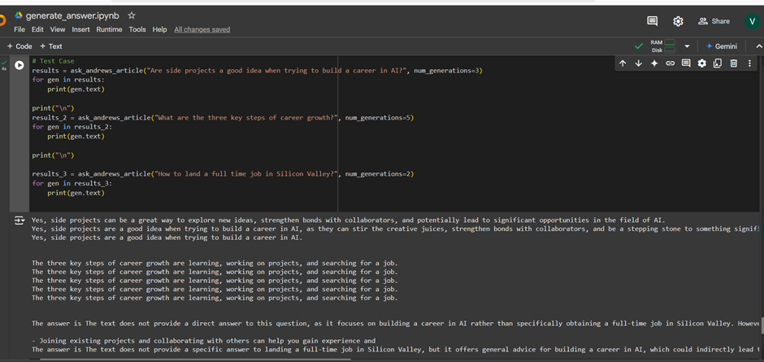

# AI Career Guidance Article Search Engine

This project provides a search engine to retrieve relevant sections from a series of articles focused on building careers in AI. It uses embeddings generated by Cohere and organizes the data for efficient search using an Annoy index.

## Features

- Retrieves and ranks the most relevant sections from the articles based on user queries.
- Utilizes Cohere embeddings for semantic similarity.
- Optimized for fast search with the Annoy library.
- Easy integration and customization for new text data.

---

## Setup Instructions

### Prerequisites

1. **Python Version**: Ensure Python 3.8 or later is installed.
2. **Cohere API Key**: Get an API key from [Cohere's website](https://cohere.ai/).

---

### Installation

1. Clone the repository:
   ```bash
   git clone https://github.com/vaishnavi477/Generative AI/Fine-Tuning.git
   cd Generating Answers

2. Install the dependencies:
    ```bash
    pip install -r requirements.txt
    ```

3. Create a .env file in the root directory and add your Cohere API key:
    COHERE_API_KEY=your_cohere_api_key

4. Run the script to initialize the index and start querying!

### Usage

## Embedding Articles

The script automatically generates embeddings for the given texts using the Cohere API and stores them in

an Annoy index for efficient querying.

## Querying

Use the function ask_andrews_article(question) to search for relevant sections based on your query.

Example:
    ```
    result = ask_andrews_article("What are the key steps in building a career in AI?")
    print(result)
    ```


