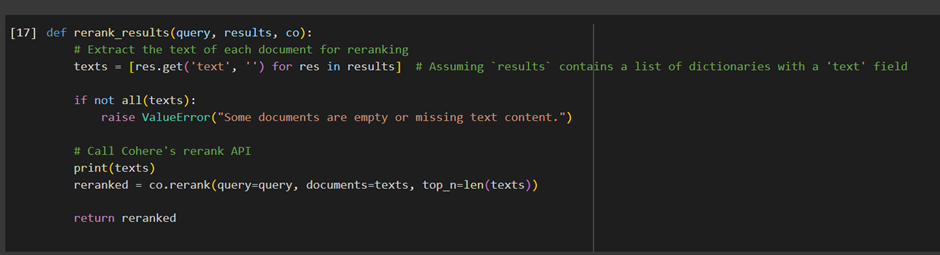
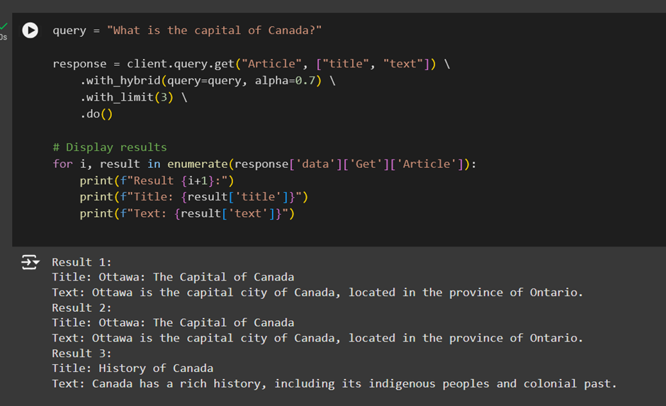
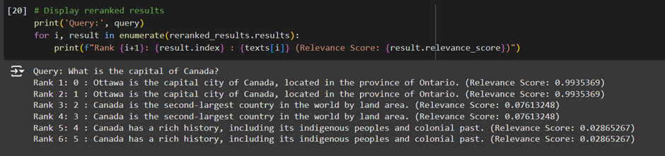

# Article Retrieval System with Weaviate and Cohere

This project demonstrates the implementation of a semantic search and reranking system using Weaviate as the vector database and Cohere for text embeddings and reranking. The system allows for efficient retrieval of articles based on text queries.

---

## Features
- Hybrid Search: Combines vector-based and keyword-based search for optimal results.
- Dense Retrieval: Retrieves relevant articles using text embeddings generated by Cohere.
- Reranking: Improves the ranking of search results using Cohere's rerank API.
- Sparse Retrieval: Implements traditional keyword search for articles.

---

## Requirements
- Python 3.8 or higher
- A running instance of Weaviate
- API keys for Cohere and Weaviate

---

## Installation
1. Clone the repository:
    ```bash
    git clone https://github.com/vaishnavi477/Generative AI/Fine-Tuning.git
    cd Keyword and Semantic Searches with ReRank.git
    ```

2. Install dependencies:
    ```bash
    pip install -r requirements.txt
    ```

3. Set up environment variables:
   - Create a `.env` file in the project root directory with the following keys:
     ```env
     COHERE_API_KEY=your-cohere-api-key
     WEAVIATE_API_URL=your-weaviate-instance-url
     WEAVIATE_API_KEY=your-weaviate-api-key
     ```

4. Run the script:
    ```bash
    python3 Keyword_Semantic_Search-ReRank.py
    ```

---

## Key Components

### 1. Schema Creation
The schema defines the `Articles` class with the following properties:
- `title`: The title of the article (string)
- `text`: The content of the article (text)

### 2. Hybrid and Dense Retrieval
- Dense Retrieval: Uses Cohere embeddings with Weaviate’s `nearText` queries.
- Hybrid Search: Combines vector similarity with keyword matching for better accuracy.

### 3. Reranking
Results from Weaviate's dense search are reranked using Cohere's `rerank` API for improved relevance.

---

## Usage
- Run the script and input a query (e.g., "What is the capital of Canada?").
- The system retrieves relevant articles and displays them ranked by relevance.
- Reranked results are shown with their new order and relevance scores.

---

## Acknowledgments
- [Weaviate](https://weaviate.io/) for the vector database.
- [Cohere](https://cohere.ai/) for text embeddings and reranking API.





