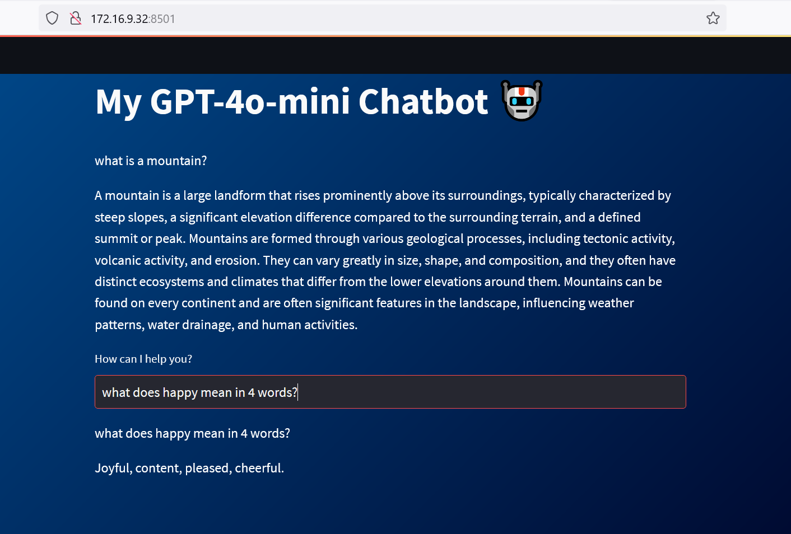
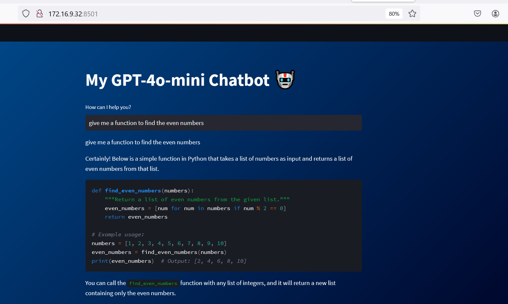
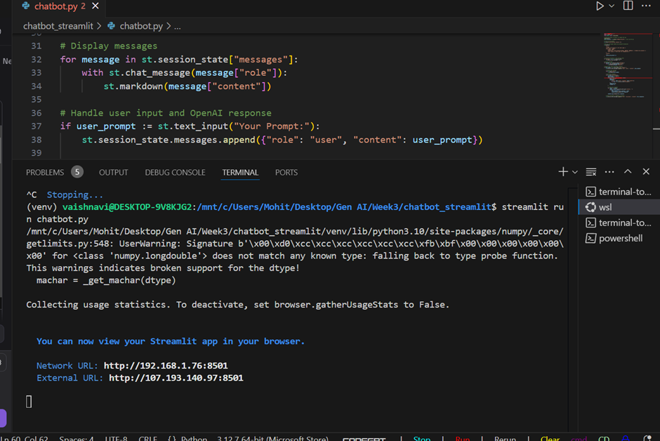

# README: GPT-4o-mini Chatbot Application with Streamlit:

## Introduction
This project is a simple chatbot interface built using Streamlit and OpenAI's GPT-4 API. The chatbot takes user input, sends it to the GPT-4o-mini model, and displays the model’s response in a web-based interface. The interface includes a custom-styled background using CSS for a visually appealing shaded blue gradient.

## Prerequisites
Before running the application, ensure you have the following:
- **Python 3.8+** installed on your system.
- **OpenAI API Key** (get it from OpenAI's website).
- A `.env` file containing your OpenAI API key.

## Installation

1. Clone the repository:
   ```bash
   git clone https://github.com/vaishnavi477/Project-ChatGPT-ChatBot-using-OpenAI-and-Streamlit.git
   cd chatbot
   ```

2. Create and activate a virtual environment:
   ```bash
   python -m venv venv
   source venv/bin/activate  # On Windows: venv\Scripts\activate
   ```

3. Install the required Python packages:
   requirements.txt includes
   streamlit==1.22.0  # Replace with the latest version if needed
   openai==0.27.0     # Replace with the latest version if needed
   python-dotenv==1.0.0

   ```bash
   pip install -r requirements.txt
   ```

4. Create a `.env` file in the root directory of the project and add your OpenAI API key:
   ```
   OPENAI_API_KEY=your_openai_api_key # Replace with your api key
   ```

## Usage

1. Run the Streamlit app:
   ```bash
   streamlit run chatbot.py
   ```

2. Open your browser and go to the local server link (usually http://10.227.6.85:8501) to interact with the chatbot.

## Features

- **GPT-4 Chatbot**: Interact with the GPT-4 model and receive responses based on your queries.
   OpenAI API Documentation - (https://beta.openai.com/docs/)
- **Full-Page Shaded Gradient Background**: The page is styled with a shaded blue gradient to enhance the user experience.
- **Session Management**: The chatbot maintains a conversation by storing previous messages in the session state. Streamlit Documentation - (https://docs.streamlit.io/)
- **Streaming Responses**: The chatbot streams responses from OpenAI's GPT-4 API for real-time feedback.

## Customization

### Modify CSS Styling
To change the background gradient or other page styles, update the CSS in the `st.markdown` block:
```python
st.markdown(
    """
    <style>
    html, body, .stApp {
        height: 100%;
        background: linear-gradient(135deg, #004e92, #000428);
        color: white;
    }
    </style>
    """,
    unsafe_allow_html=True
)
```

### OpenAI Model Configuration
By default, the app uses the `gpt-4o-mini` model. To change it to another model or adjust other parameters like `temperature`, modify the `openai.chat.completions.create()` call:
```python
stream = openai.chat.completions.create(
    model="gpt-4o-mini",
    messages=[...],
    temperature=0,  # Adjust temperature for more or less creative responses
    stream=True,
)
```
## Contact
For any queries, feel free to reach out to the project maintainer at vpatil29306@student.sfbu.edu.

## Screenshot of execution results



